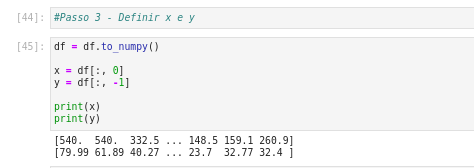
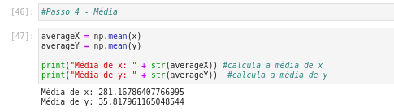
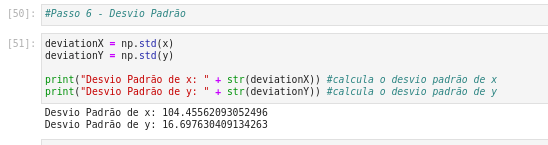
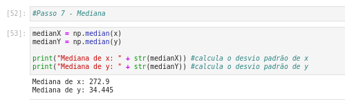
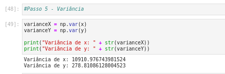
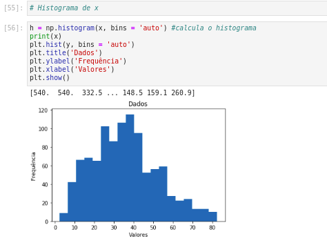
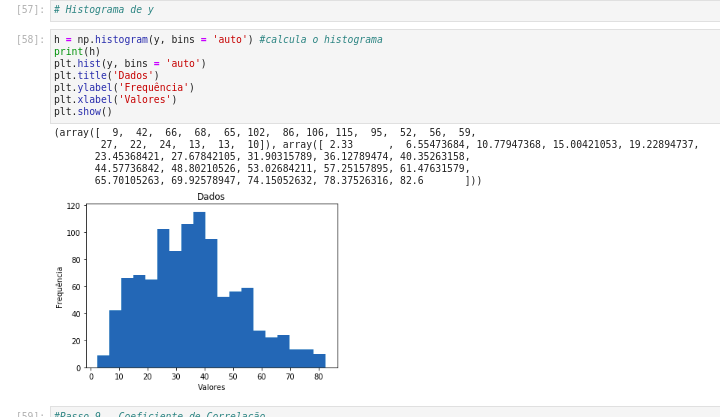
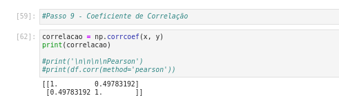
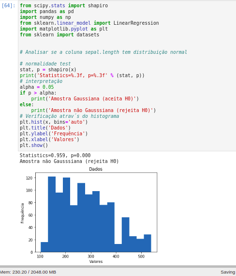
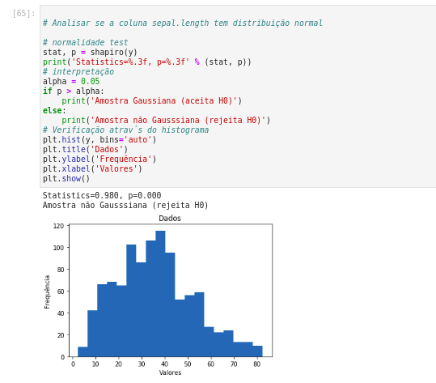

<p align="center">
  

  
  
  <a href="https://github.com/antuniooh/probability-and-statistics-database-analysis/commits/master">
    
  </a>
  
   
</p>

<!-- PROJECT LOGO -->
<br />
<p align="center">
  <a href="https://github.com/antuniooh/probability-and-statistics-database-analysis">
    
  </a>
</p>

<p align="center">
  
  
    
</p>

<!-- TABLE OF CONTENTS -->
<details open="open">
  <summary>Table of Contents</summary>
  <ol>
    <li>
      <a href="#-about-the-project">About The Project</a>
    </li>
    <li>
      <a href="#-how-to-run">How To Run</a>
    </li>
  </ol>
</details>

<!-- ABOUT THE PROJECT -->
## 💻 About The Project
Semester project for the subject of Probability and Statistics, a subject attended at Centro Universitário FEI. It consists of analyzing a database

**1 - Read** - It reads the database, eliminating duplicate data, NAN and missing data. In addition to defining the X and Y. The X refers to the first column of the database and the Y to the last




**2 - Average** - Performs averaging for x and y.



**3 - Standard deviation** - Performs standard deviation calculation for x and y.



**4 - Median** - Performs the median calculation for x and y.



**5 - Variance** - Performs the variance calculation for x and y.



**5 - Histogram** - Determines the histogram of x and y.




**6 - Correlation Coefficient** - Calculates the correlation coefficient of x and y.



**7 - Normality Test** - Performs normality test for y and x.




<!-- HOW TO RUN -->
## 🚀 How To Run

```bash

# Clone the repository
$ git clone https://github.com/antuniooh/numerical-calculation-database-analysis.git

# Access the project folder in your terminal / cmd
$ cd numerical-calculation-database-analysis/src

# Install the libs
$ python -m pip install -U pip
$ python -m pip install -U matplotlib
$ python -m pip install -U numpy
$ python -m pip install -U pandas

# In both Windows and Linux, the execution is done by executing the following line in the terminal, or using an IDE of your choice.
$ python main.py

```
The .ipynb file can also be run on your preferred platform like Jupyter Notebook, Google Colab and the like, just import the "main.ipynb" file and run.

## 🤖 Authors

[Antonio Gustavo](https://github.com/antuniooh)           |  [Henrique Vital](https://github.com/henriquevital00)           |  [Erik Silva](https://github.com/Erikfernandoms)
:-------------------------:|:-------------------------:|:-------------------------:
  |  | 
22.119.001-0 | 22.119.078-8 | 22.119.074-7
