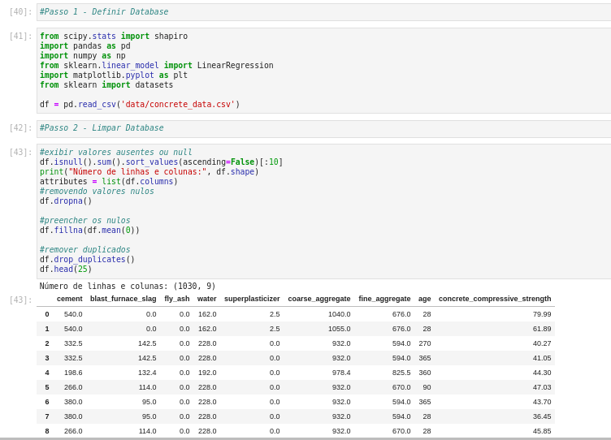

** Copiei os codigos de aula no arquivo src/main, porém não tenho a menor caralha de ideia de se ta certo -> TODO: Verificar**

# DatabaseAnalysisProject

Projeto semestral para a matéria de Probabilidade e Estatística, disciplina cursada no Centro Universitário FEI. Consiste na análise de um database

## Funcionalidade

**1 - Leitura** - Realiza a leitura do database, eliminando dados duplicados, das NAN e dados faltantes. 



## Execução

Tanto no Windows quanto no Linux a execução é feita a partir da execução da linha a seguir no terminal, ou utilizando uma IDE de sua preferência. É necessário instalar certas bibliotecas antes de executar o projeto em si.

```bash
python main.py
```

O arquivo .ipynb pode ser executado também em sua plataforma de preferência, como Jupyter Notebook, Google Colab e afins, basta importar o arquivo "main.ipynb" e executar.

## Integrantes

O projeto em questão foi desenvolvido por 3 pessoas.

Antonio Muniz - https://www.linkedin.com/in/antuniooh/
